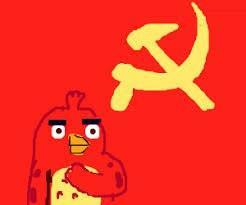

# Pepita, vola!

## Conozcamos a Pepita

Pepita es una golondrina que sabe volar y comer.
Inicialmente tiene 100 joules de energía.

Sabemos que:
* Al volar gasta 5 joules de energía por cada kilómetro volado, más 40 joules para comenzar a volar.
* Por cada gramo que come gana 2 joules de energía

Queremos hacer con pepita desde la consola:
* Consultar su energía
* Que vuele 2 kilómetros
* Saber cuánta energía tiene en ese momento
* Darle de comer 8 gramos de alpiste
* Volver a preguntarle su energía

Las pruebas manuales para esta primer parte están [acá](https://github.com/pdep-mit/ejemplos-de-clase-wollok/blob/master/src/clase01/pruebasManuales/prueba1-pepita.md)

## Aparece Josefa

Queremos agregar a nuestro sistema a Josefa, 
que también sabe volar y comer, sólo que lo hace distinto.

A Josefa parece interesarle cuánto le pedimos que vuele y 
cuánto le pedimos que coma. Entonces en vez de recordar cuánta energía tiene, 
prefiere calcular esa información.

La energía de Josefa se calcula como 
`su energía inicial + 5 * gramos comidos - 3 * kilómetro volados`. 
La energía inicial de Josefa es 80.

Cuando le pedimos que coma una cantidad de gramos de alpiste o 
que vuele una cantidad de kilómetros sólo necesitamos aumentar los gramos 
comidos o kilómetros volados respectivamente.

Además a Josefa le podemos preguntar cómo se siente, y debe respondernos:
* "Explotada" si la hicimos volar pero no la alimentamos
* "Bonita y gordita" si le dimos más de comer de lo que la hicimos volar
* "Enérgica" si su energía es mayor a su energía inicial
* "Indiferente" en cualquier otro caso

> Jugar un poco con Josefa desde la consola, haciendo que vuele y que coma, consultando su energía y su estado emocional.

Las pruebas manuales para esta segunda parte están [acá](https://github.com/pdep-mit/ejemplos-de-clase-wollok/blob/master/src/clase01/pruebasManuales/prueba2-josefa.md)

## Entrenador de pajaritos

Agregamos a nuestro sistema al entrenador, que debe poder entrenar a un pájaro que le indiquemos. Su rutina de entrenamiento es la siguiente:
* Alimentar al pajarito 10 gramos de alpiste
* Mandarlo a volar 20 kilómetros
* Si la energía del pajarito es menor a 20, darle de comer 10 gramos de alpiste, de lo contrario darle de comer 2 gramos.

> Hacer que el entrenador entrene a Pepita y luego a Josefa.

Las pruebas manuales para esta tercer parte están [acá](https://github.com/pdep-mit/ejemplos-de-clase-wollok/blob/master/src/clase01/pruebasManuales/prueba3-entrenamiento.md)

## Última extensión

Queremos a agregar un ave que tiene una compañera, su nombre es Beti y se va a comportar así:
* su energía va a ser la misma que la de su compañera, 
* cuando come x cantidad de alpiste, le da de comer la mitad a su compañera,
* cuando vuela x kms, su compañera también.

Necesitamos poder indicarle a Beti quién es su compañera, y queremos que el entrenador también pueda entrenar a Beti.

